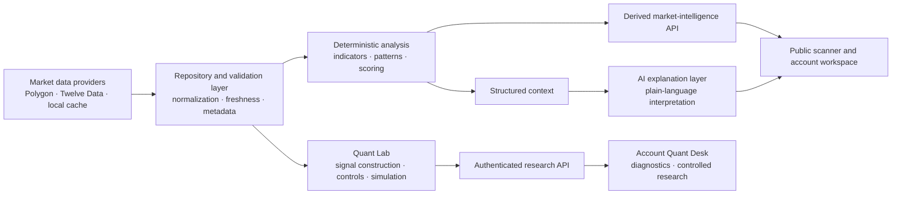
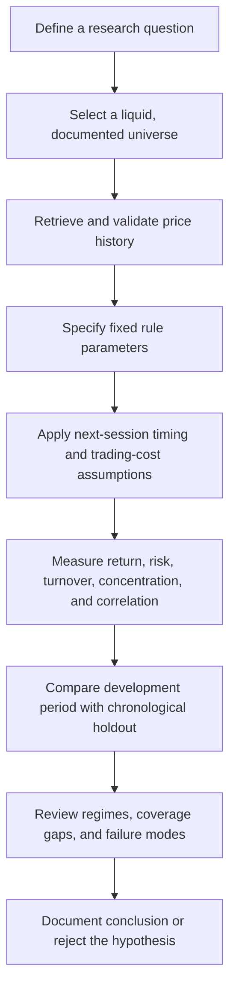
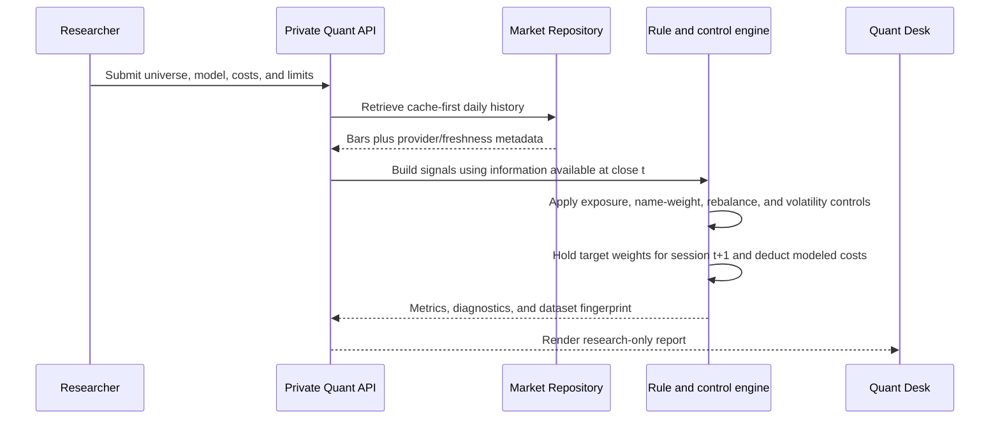
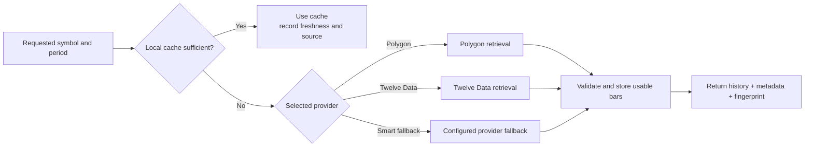

<div align="center">


# Oryntra AI

### Market Intelligence · Systematic Research · Explainable Analysis

**I built Oryntra as a private-first research platform for inspecting historical market behaviour, testing transparent rules, and communicating evidence with appropriate limits.**

</div>

---

> **Research software, not an investment adviser.** Oryntra does not connect to a brokerage account, create orders, or tell a user what to buy or sell. Historical simulations are analytical outputs, not forecasts, recommendations, or a promise of performance.

## Why I built it

Oryntra began as my high-school passion project. I want to become a quantitative researcher and, eventually, build my own firm. This is where I am teaching myself to take that ambition seriously: by building real software, asking better market questions, documenting the answers, and being honest about what I still do not know.

I built Oryntra around a simple premise: a useful research product should make its assumptions visible. Instead of hiding a conclusion behind an opaque score, I want the product to show where market data came from, use deterministic calculations where they matter, expose the controls applied to a hypothetical portfolio, and report where the historical evidence is weak. Oryntra is for forming and challenging research hypotheses—not manufacturing certainty.

This repository brings together a FastAPI service, a browser workspace, a local market-data cache, a policy-aware account scanner, and Quant Lab. I keep the public experience intentionally limited to derived analysis. Backtesting, Pattern Lab, cache maintenance, and developer tools remain private. Quant Lab can be exposed only when explicitly enabled and only with the appropriate data-provider rights and access policy.

The operating model is informed by public research discipline: start from an observable question, separate a signal from its implementation, quantify cost and concentration, test over time, and state what the evidence cannot establish. That is a product and engineering standard for Oryntra—not a claim that it reproduces any firm’s proprietary research or trading systems.

## What I designed Oryntra to do

| Area | Oryntra provides | Oryntra does not provide |
| --- | --- | --- |
| Market intelligence | Derived technical states, deterministic pattern observations, and explainable summaries | A guarantee that a state predicts a future return |
| Quantitative research | Transparent strategy comparators, configurable assumptions, chronological holdouts, and risk diagnostics | Live trading, broker connectivity, or an automated execution engine |
| Data handling | Local-cache-first history retrieval with provider metadata and a reproducible dataset fingerprint | A license to redistribute raw vendor market data |
| AI | Plain-language interpretation of structured, server-side outputs | AI-generated numeric indicators, discretionary trade advice, or a replacement for validation |
| Product operation | Authentication, access boundaries, paper-trade records, and a responsive research workspace | A production institutional order-management, compliance, or surveillance stack |

## System at a glance



The diagram represents a boundary as well as a flow. Provider credentials remain server-side; raw vendor data is not intended to become a public product response. Analysis and language explanation consume structured internal results. Private research routes are opt-in at startup, so the public scanner and the research workbench can operate as different product surfaces rather than as one broad, unrestricted API.

## How I approach research

### 1. Decompose the question before measuring it

Market outcomes are the result of many overlapping forces. I therefore keep data retrieval, indicator calculation, pattern detection, portfolio construction, and explanation as distinct components. A trend measurement is not the same thing as a portfolio rule; a portfolio rule is not the same thing as an execution system; and a strong in-sample chart is not the same thing as evidence of persistent performance. That separation makes each layer easier to audit and replace without rewriting the product.

### 2. Treat every signal as a hypothesis

I treat RSI, moving averages, Bollinger Bands, price patterns, trend rules, and relative-strength screens as useful starting points—not automatic predictors. The workflow asks whether a rule survives explicit timing, costs, borrow assumptions, multiple market environments, and a chronological holdout. If it does not, the right conclusion is that the hypothesis failed under the tested assumptions—not that another indicator should be marketed as certain.

### 3. Make risk visible beside return

I care as much about failure modes as attractive historical results. Oryntra reports drawdown, volatility, turnover, estimated historical value at risk, expected shortfall, gross and net exposure, concentration, correlation, data coverage, and regime slices beside return metrics. These measurements are descriptive and model-dependent, but they create a better conversation than a single confidence score.

### 4. Keep the public surface narrow

I require an account before scanner analysis can run. Backtesting, cache tooling, and developer tools are private-only. Quant Lab requires an account in every mode; it is private by default and can be mounted for signed-in users only when `ORYNTRA_PUBLIC_QUANT_LAB_ENABLED=true`. This avoids exposing raw market-data workflows or experimental controls as a public recommendation service.

---

## Research lifecycle



This sequence is intentionally conservative. It does not search a large parameter space and then label the best historical result as a discovery. The current strategy sleeves are transparent comparators with user-visible controls. A research conclusion should remain provisional until it has been evaluated on appropriate point-in-time data, a universe that includes delisted securities where relevant, realistic liquidity and shorting assumptions, and untouched out-of-sample periods.

## Quant Lab

I built Quant Lab as Oryntra V1.0’s separate systematic-research workspace. It evaluates a selected universe of daily closing-price histories using rules fixed before each run. The V1.0 corporate quant system adds a local, source-auditable point-in-time repository for public corporate disclosures and macro observations. It runs independently of the scanner and does not place trades. I designed it to help a user understand how a defined portfolio rule would have behaved historically after the requested controls and cost assumptions—not to identify a “best” strategy.

For repeatable hypothesis testing, a small declarative experiment runner takes daily `date,ticker,close,volume` CSV data and a versioned JSON manifest. It records the hypothesis, fixed sleeve rules, parameters, fingerprint, chronological holdout, and equal-weight buy-and-hold reference alongside the result. It accepts configurations, not arbitrary code: that is intentional, because an experiment should remain inspectable rather than becoming a parameter-search black box. The full workflow and example manifest are in [server/QUANT_LAB.md](server/QUANT_LAB.md).

### Strategy comparators

| Sleeve | Question it examines | Primary failure mode |
| --- | --- | --- |
| V1.0 time-series trend | Does an asset’s own trailing direction persist into the next holding period? | Whipsaw during repeated range-bound reversals |
| V1.0 cross-sectional momentum | Do relative leaders and laggards continue to separate within a broad universe? | Momentum crashes and leadership turnover |
| V1.0 mean-reversion comparator | Do unusually large short-window moves partially reverse after a volatility check? | Fighting a genuine breakout or trend |
| V1.0 defensive low-volatility sleeve | Does a lower-realized-volatility group behave differently from a higher-volatility group? | Concentration and lag in high-beta leadership |
| Corporate quality and change sleeve | Do eligible public changes in growth, margins, cash generation, revisions, ownership, and capital structure produce a persistent cross-sectional signal? | Sparse, revised, incomparable, or late-tagged corporate records |

The V1.0 corporate quant system combines the price sleeves with the corporate-quality sleeve, then adjusts their visible contribution weights through a probability-like regime model. Its macro features are policy rate, 2-year/10-year yield curve, credit spread, and inflation, all eligible only after their recorded public availability timestamp. It also reports a daily-dollar-volume cost proxy, factor/relative-value decomposition, and recent strategy-health decay. The V1.0 price baselines remain transparent comparators. The server normalizes selected positive allocations to 100%; it does not silently apply unbounded leverage.

### How a Quant Lab run works



The timing convention is explicit: signals are formed at the close of session **t**, then held over the following session. Transaction costs are deducted when portfolio weights change, and a short-borrow assumption is applied to short exposure. Volatility targeting can reduce exposure to the requested target but is not permitted to increase exposure beyond the configured limit. Gross-exposure and single-name caps are applied before the simulated holdings are evaluated.

### Research controls and diagnostics

| Control or diagnostic | What it is intended to reveal |
| --- | --- |
| Configurable cost and borrow assumptions | Whether an apparent result depends on unrealistically frictionless trading |
| Daily, weekly, or monthly rebalancing | The trade-off between responsiveness and turnover |
| Gross and single-name limits | Whether an outcome is driven by excessive portfolio concentration |
| Volatility target | Whether the rule’s historical risk would have required scaling down exposure |
| Chronological development/holdout split | Whether a fixed rule behaves materially differently in later history |
| Regime report | Sensitivity to broad trend and volatility states in the selected universe |
| Correlation matrix | Pairs whose diversification benefit may disappear when they move together |
| Monthly return heatmap | Clustering, gaps, and dispersion in net simulated monthly results |
| Equity, drawdown, and rolling-volatility paths | The path of risk, not only the ending value |
| Data-quality and source metadata | Missing bars, usable overlap, freshness, provider, and cache provenance |

The correlation heatmap is a trailing, pairwise daily-return matrix. The monthly heatmap aggregates the exact net simulated return series after the configured cost model. The equity, drawdown, and rolling 63-session volatility charts are derived from the same simulated portfolio. They are not decorative visualizations; each is a different view of the output being evaluated.

## Data architecture and provenance

I use a repository layer so downstream analysis can work with a consistent daily OHLCV-shaped frame regardless of source. Ticker formats are normalized, timestamps are de-duplicated and ordered, bars are validated for basic numerical integrity, and retrieval metadata follows the result. That makes provider choice a visible part of a research run instead of an invisible implementation detail.

### Provider path



`cache_only` is useful when a run must be reproducible from locally available history. `auto` begins from the cache and may use a configured provider when sufficient history is absent. `polygon` and `twelvedata` are explicit provider preferences. Twelve Data is optional and enabled through a private environment variable; its shared request limiter must remain at or below the allowance of the selected plan. Credentials are never stored in frontend code or committed configuration.

The current repository does not claim point-in-time fundamentals, complete delisted-security coverage, order-book history, corporate-action reconstruction beyond the supplied source, or institutional execution data. Those omissions matter. They are documented in the product because a professional research process should identify material data gaps before interpreting a chart.

## Analysis and explanation stack

The deterministic analysis engine provides the structured observations used across the platform, including common technical measures such as RSI, MACD, moving averages, VWAP, Bollinger Bands, ATR, ADX, support/resistance relationships, and selected market-structure and pattern observations. These measurements are calculations, not predictions. Their role is to describe a condition in a reproducible way that can be compared across symbols and time periods.

The Pattern Lab builds higher-level observations from deterministic rules. Examples include continuation or reversal contexts, consolidation, volatility expansion, liquidity sweeps, fair-value gaps, break-of-structure, and change-of-character conditions. A pattern label should be interpreted as the output of a documented detector under a defined lookback—not as proof that a market will move in a particular direction.

The AI explanation layer receives structured quantitative context rather than replacing the underlying calculations. Its role is to translate indicator states, risk observations, and detected conditions into readable educational language. Numerical indicator construction stays deterministic and server-side. This separation preserves traceability: a user can inspect the facts used in an explanation instead of treating the explanation itself as the source of truth.

## Application architecture

| Layer | Primary responsibility | Representative modules |
| --- | --- | --- |
| API and lifecycle | FastAPI app, startup, compression, route registration, health status | `server/backend/main.py`, `server/run.py` |
| Access boundary | Account/session flows and public/private research access rules | `server/backend/routes/auth.py`, `analysis_access.py` |
| Market repository | Provider selection, cache access, normalization, metadata, and fingerprints | `market_repository.py`, `market_cache.py`, `polygon_client.py`, `twelvedata_client.py` |
| Deterministic analysis | Indicators, scoring, patterns, setup detection, and backtests | `indicators.py`, `pattern_analyzer.py`, `patterns/`, `backtest.py` |
| Quant Lab | Strategy sleeves, corporate/macro point-in-time inputs, portfolio controls, simulations, validation, and diagnostics | `quant_research.py`, `quant_system.py`, `corporate_repository.py`, `routes/quant.py` |
| Explanation | Structured analysis context and natural-language interpretation | `routes/ai_explain.py`, `vai_model.py`, `vai2_model.py` |
| Client | Browser workspace, settings, private Quant Desk, and legal pages | `server/frontend/` |
| Persistence | SQLite-backed application and local-market-data storage | `database.py`, `server/data/oryntra.db` |

### Repository map

```text
Oryntra-AI/
├── README.md                         # Product, architecture, and operating model
├── brand-assets/                     # Oryntra identity assets
└── server/
    ├── backend/
    │   ├── main.py                   # FastAPI composition and route boundaries
    │   ├── market_repository.py      # Provider, cache, validation, provenance
    │   ├── quant_research.py         # Private systematic-research engine
    │   ├── routes/                   # API surfaces grouped by capability
    │   └── patterns/                 # Deterministic pattern detectors
    ├── frontend/                     # Browser application and legal pages
    ├── tests/                        # Regression and research-engine tests
    ├── tools/                        # Cache, backtest, and research utilities
    ├── QUANT_LAB.md                  # V1 Quant Lab operating and interpretation guide
    ├── requirements.txt              # Python runtime dependencies
    └── .env.example                  # Safe configuration template
```

## Running locally

The following creates an isolated local environment and starts the FastAPI service. It intentionally uses the provided environment template rather than a committed key file.

```bash
cd server
python3 -m venv .venv
.venv/bin/pip install -r requirements.txt
cp .env.example .env
PYTHONPATH=. .venv/bin/python3 run.py
```

The default address is `http://127.0.0.1:8001`. Configure `ORYNTRA_PUBLIC_SCANNER_WEBSITE=true` to serve the browser workspace. Configure `ORYNTRA_PRIVATE_RESEARCH_ROUTES=true` only for private/local research use; it enables Quant Lab, backtests, and developer research routes locally. A public signed-in Quant Lab is a separate, explicit setting documented below.

### Configuration categories

| Category | Examples | Purpose |
| --- | --- | --- |
| Network | `PORT`, `PUBLIC_BASE_URL`, `ORYNTRA_CORS_ORIGINS` | Local service address and allowed origins |
| Provider access | `POLYGON_API_KEY`, `TWELVEDATA_API_KEY` | Private server-side market-data credentials |
| Provider safety | `ORYNTRA_POLYGON_CALLS_PER_MINUTE`, `ORYNTRA_TWELVEDATA_CALLS_PER_MINUTE` | Rate limits aligned to the configured data plan |
| Research boundary | `ORYNTRA_PRIVATE_RESEARCH_ROUTES`, `ORYNTRA_PUBLIC_DERIVED_ANALYSIS_ENABLED` | Public/private capability separation |
| Cache operation | `ORYNTRA_MARKET_CACHE_*` | Refresh, retention, and maintenance controls |
| Product policy | `ORYNTRA_OWNER_EMAILS`, subscription and analysis-limit settings | Access and operational policy |

### Public site with browser-direct provider keys

For a public account site, leave platform provider keys empty. A user pastes a Polygon / Massive or Twelve Data key into the browser-only connection screen; the browser sends it directly to the provider, then forwards normalized daily bars to Oryntra for the requested calculation. Oryntra's server does not receive, store, log, or return the provider key. Browser-direct scanner and Quant Lab uploads validate their size and values, process raw bars in memory, and return derived research only; they do not persist raw OHLCV bars.

To expose the scanner, set `ORYNTRA_PUBLIC_SCANNER_WEBSITE=true` and `ORYNTRA_BROWSER_DIRECT_ANALYSIS_ENABLED=true`. To expose Quant Lab to signed-in users, additionally set `ORYNTRA_PUBLIC_QUANT_LAB_ENABLED=true`; keep private research routes false. The browser-direct connection changes key handling, not provider or exchange rights: verify that each provider plan and intended use is allowed before enabling it publicly.

Never commit a populated `.env`, provider credential, user database, or unreviewed raw-data archive. The database and cache can contain information that should remain local even when the application code is published.

## Verification

The repository includes focused backend regression tests and syntax checks. From `server/`, run:

```bash
PYTHONPATH=. .venv/bin/python3 -m unittest discover -s tests -v
.venv/bin/python3 -m py_compile backend/quant_research.py backend/quant_system.py backend/corporate_repository.py backend/vai2_model.py
node --check frontend/static/js/app.js
```

For a release candidate, verify the actual health endpoint after startup, exercise a cache-only Quant Lab run, exercise a configured-provider fallback if credentials are available, and inspect the browser console after a clean reload. A listening port is not sufficient evidence that the application path is healthy; the returned `/health` payload, selected UI routes, and the intended access boundary should all be checked.

## Research limitations and disclosures

Historical performance is not a guarantee of future results. Backtests can be distorted by survivorship bias, selection bias, data revisions, market-impact assumptions, parameter search, implementation shortfall, and the absence of realistic liquidity or borrow constraints. Diversification and correlation analysis can reduce some forms of concentration but cannot eliminate losses.

Oryntra’s current Quant Lab works with daily historical closes and configured cost assumptions. It is not a high-frequency system, execution simulator, smart-order router, risk-management system for live capital, or substitute for regulated advice. Do not use the product to make an investment decision without independent research and, where appropriate, advice from a qualified professional.

## Research references and design influences

The project uses original documentation and original code. The following public materials informed the high-level research framing: decomposing return drivers and balancing risks across uncertain environments; connecting research, technology, and market mechanics; treating implementation, liquidity, and risk management as first-class concerns; and demanding evidence after costs and proper out-of-sample testing.

- [Bridgewater — The All Weather Story](https://www.bridgewater.com/research-and-insights/the-all-weather-story)
- [Jane Street — Trading, Research, Tech](https://www.janestreet.com/what-we-do/overview/)
- [Citadel Securities — What Is a Market Maker?](https://www.citadelsecurities.com/what-we-do/what-is-a-market-maker/)
- [AQR — How Do Factor Premia Vary Over Time? A Century of Evidence](https://www.aqr.com/insights/research/journal-article/how-do-factor-premia-vary-over-time-a-century-of-evidence)

These references do not endorse Oryntra AI, and Oryntra does not represent or replicate their private systems, trading strategies, data, execution capabilities, or investment products.
