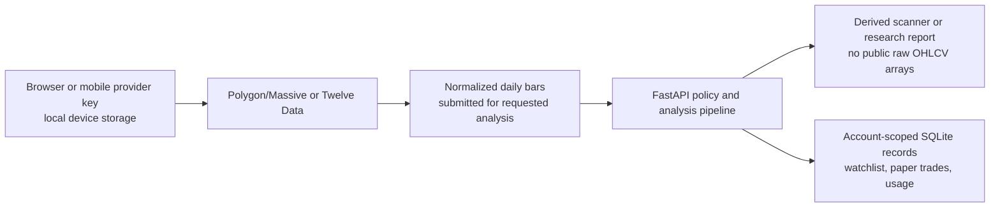

<div align="center">


# Oryntra AI

### Market intelligence · systematic research · explainable analysis

**A browser and Flutter research workspace for examining market evidence, recording paper hypotheses, and testing transparent historical rules.**

</div>

> Oryntra is educational research software. It does not connect to a brokerage, place orders, manage money, or promise future performance. A displayed signal, score, scenario, or backtest result is not investment advice.

## What is in this repository

Oryntra has three cooperating product surfaces:

1. A FastAPI backend that owns accounts, policy, derived analysis, research engines, storage, and optional private tools.
2. A static browser workspace with Scanner, Watchlist, Paper trades, Backtest, Quant Lab, and Settings.
3. A Flutter client with Scanner, Watchlist, Paper, Quant Lab, and Account, plus iOS notifications, background-task support, ads/consent plumbing, secure local credential storage, and a home-screen widget.

The current source describes version `1.0.0`. The iOS project declares Flutter build `1.0.0+18`. 
## Documentation map

- [Features, models, and architecture](docs/FEATURES_MODELS_AND_ARCHITECTURE.md) is the main human-readable guide to every product capability and model family.
- [Master technical manual](docs/Oryntra_AI_Master_Technical_Documentation.txt) is the exhaustive, generated catalogue of every Git-tracked file, route, module, configuration surface, asset, and test.
- [Quant Lab guide](server/QUANT_LAB.md) explains the research profiles, sleeves, controls, liquidity assumptions, validation, and diagnostics.
- [Release readiness](V1_RELEASE_READINESS.md) records what has actually been checked and what still requires live or App Store verification.
- [iOS release status](docs/IOS_RELEASE_AND_INTELLIGENCE_ROADMAP.md) records the user-reported submission state. Despite the legacy filename, it no longer presents unapproved heatmap or macro work as a committed roadmap.

The master manual is generated from `git ls-files`, so it documents the exact version-controlled surface and excludes private `.env` values, databases, market caches, virtual environments, and untracked Flutter/Xcode output.

## Current model map

| Name | What it is | Current role |
| --- | --- | --- |
| V1.0 Official Momentum | Deterministic scanner/setup policy selected by public intelligence routes | Released scanner model label |
| V8 evidence model | Symmetric deterministic candidate scorer built from factor families and risk gates | Research candidate; not the public default |
| VAI 1.0 Experimental | Locally trained logistic candidate layered over Official Momentum candidates | Legacy research path with fallback behavior |
| VAI 2.2 Chronological PIT Experimental | Train/validation/test model with purge gaps, promotion checks, return and stop-risk outputs | Newer experimental research path; not silently promoted to public scanner |
| Oryntra V1.0 Quant Lab | Portfolio-research framework with six profiles and five sleeves | Separate historical research system, not a scanner replacement |

Internal identifiers retain earlier names such as `v7`, `v8_*`, and `vai2`. Those are compatibility and research identifiers; they are not proof that the public product is on a numbered generation implied by the identifier.

## Major user features

| Capability | Browser | Flutter/iOS | Important boundary |
| --- | --- | --- | --- |
| Account creation, sign-in, sign-out, deletion | Yes | Yes | Server-side session and ownership checks |
| Provider connection | Browser-local IndexedDB | Secure device storage | Keys go directly to Polygon/Massive or Twelve Data in browser/mobile direct mode; Oryntra receives normalized bars, not the key |
| Single-symbol scanner | Yes | Yes | Public routes force Official Momentum and return derived output without raw OHLCV arrays |
| Indicator, setup, pattern, level, and plan display | Yes | Yes | Deterministic educational evidence, not a forecast |
| TradingView chart | Browser link/embed behavior | Native WebView embed | Chart data is supplied independently by TradingView |
| Watchlist | Yes | Yes | Account-scoped saved symbols; can launch a scan |
| Paper trades | Yes | Yes | Simulated records only; no broker fills or orders |
| Historical backtest | Yes | Not a standalone mobile tab | Browser-upload route is authenticated and does not persist uploaded raw bars |
| Quant Lab | Yes | Yes | Daily historical simulation with explicit controls; no execution |
| AI explanation | Yes | API capability available | Converts structured analysis to prose; does not calculate core numeric indicators |
| Notifications and tracked-symbol alerts | No native browser notifications in this source | Yes | Depends on iOS permission and server alert registration |
| Latest-scan widget | No | Yes | Reads shared app-group values written after a scan |
| Advertising and privacy consent | Optional, flag-controlled AdSense | Consent-gated AdMob using bundled or build-time unit IDs | No ads on Flutter web |
| Pattern Lab, VAI training, cache tools | Hidden/private | Not a normal mobile surface | Mounted only in private research mode |
| Maintenance site | Separate server surface | N/A | Remains independent of the primary application |

## Data flow and privacy boundary



Private/local server mode also supports server-configured providers and a durable market cache. That is a different operating path from browser/mobile direct mode and must not be confused with how provider keys are handled in the released clients.

## Quant Lab in one paragraph

Quant Lab combines selected time-series trend, cross-sectional momentum, short-horizon mean-reversion, defensive low-volatility, and point-in-time corporate-quality sleeves. It applies user-visible allocations, optional regime-conditioned weighting, single-name and gross-exposure limits, weekly/daily/monthly rebalancing, one-way volatility scaling, next-session timing, base costs, optional square-root ADV impact, and short-borrow cost. Reports include component and ensemble metrics, chronological holdout and walk-forward slices, regimes, exposure/concentration, liquidity participation, factor attribution, strategy-health decay, a trailing correlation matrix, correlation-convergence stress, monthly returns, equity, drawdown, rolling volatility, data coverage, and a dataset fingerprint.

Macro support is limited to the five point-in-time series already accepted by the corporate repository: policy rate, 2-year yield, 10-year yield, credit spread, and inflation. The repository does **not** contain a shipped market-heatmap product, broad macro dashboard, institutional optimizer, multi-day liquidation scheduler, fire-sale feedback engine, broker integration, or autonomous trading system.

## Operating modes

| Setting | Effect |
| --- | --- |
| `ORYNTRA_PUBLIC_SCANNER_WEBSITE` | Serves the browser workspace instead of an API status object at `/` |
| `ORYNTRA_PRIVATE_RESEARCH_ROUTES` | Mounts private analysis, backtest, pattern, developer, Pro, OpenAPI, and cache-worker surfaces |
| `ORYNTRA_PUBLIC_QUANT_LAB_ENABLED` | Mounts the authenticated Quant Lab surface without enabling all private research routes |
| Browser-direct analysis policy | Allows authenticated browser/mobile bar upload while keeping provider credentials off the server |
| Advertising configuration | Web AdSense is flag-controlled; native AdMob initializes only after the consent flow and supports build-time production/test IDs |

See `server/.env.example` and the master manual for the complete safe variable-name inventory. Never commit populated credentials or copy a live database/cache into a deployment archive.

## Local development

Backend:

```bash
cd server
python3 -m venv .venv
.venv/bin/pip install -r requirements.txt
cp .env.example .env
PYTHONPATH=. .venv/bin/python3 run.py
```

Flutter client:

```bash
cd ios-app
flutter pub get
flutter run
```

The backend defaults to `http://127.0.0.1:8001`. Configure the client endpoint and server policy for the environment being tested; a process listening on a port is not sufficient evidence—check `/health` and the intended signed-in flow.

## Verification

```bash
cd server
PYTHONPATH=. .venv/bin/python3 -m unittest discover -s tests -v
node --check frontend/static/js/app.js
.venv/bin/python3 -m py_compile tools/generate_master_docs.py
.venv/bin/python3 tools/generate_master_docs.py

cd ../ios-app
flutter analyze
flutter test
plutil -lint ios/Runner/Info.plist ios/Runner/PrivacyInfo.xcprivacy ios/OryntraWidget/Info.plist
flutter build ios --release --no-codesign
```

Backend tests do not prove a working mobile archive, notification permission flow, widget refresh, live provider entitlement, public deployment, or App Store approval. Record those separately when they are actually verified.

## License

See [LICENSE](LICENSE). Provider integration does not grant market-data redistribution rights; operators remain responsible for their provider plan, retention, display, and public-use permissions.
